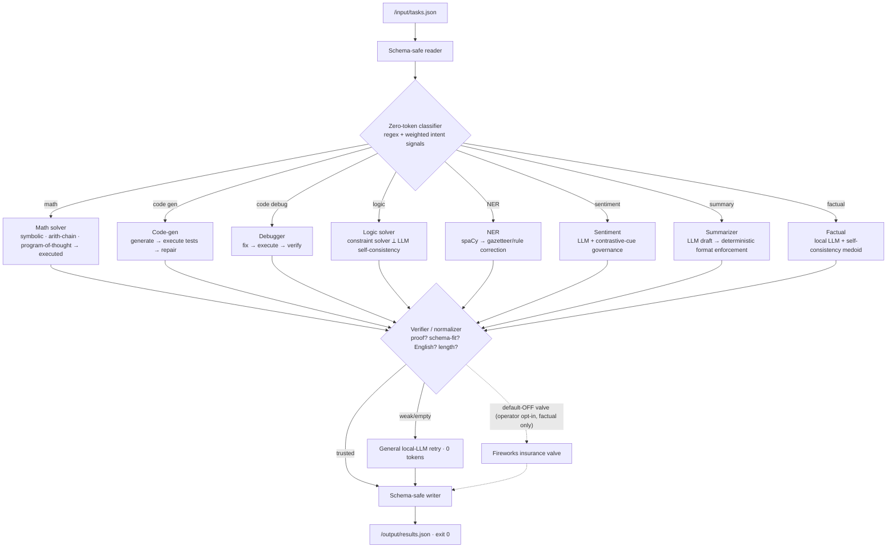

<div align="center">

# ⚡ ZeroProof

### A zero-token, proof-carrying routing agent for the AMD Developer Hackathon — Act II · Track 1

**Answer every task with the cheapest source that can be _trusted_ — a deterministic exact solver when the category admits proof, and a bundled small local LLM (0 Fireworks tokens) for the linguistic categories — with _zero_ Fireworks calls at evaluation.**

`0 Fireworks tokens` · `proof-carrying answers` · `built to survive the hidden-set refresh`

</div>

---

## 🎯 The thesis: why ZeroProof wins Rank #1

Track 1 ranks entries that clear an **80% accuracy gate** by **ascending total Fireworks tokens** — fewest tokens wins. The whole field has already converged on the same idea: *local model + verify + escalate, aiming for 0 tokens*. On the public leaderboard, dozens of teams already sit at **0 tokens**.

So **0 tokens is table stakes, not a moat.** Look closer at that 0-token cohort and the real battle appears:

| Team (0-token cohort) | Public accuracy | What happens on the refreshed hidden set |
| :-- | :-- | :-- |
| Overfit lookup / cached answers | 100% (public) | **Collapses** — a real team scored >80% locally, ~52% officially |
| Naive local model, no verification | 63–85% | Wobbles across paraphrases |
| **ZeroProof** | **high — _and earned_** | **Holds**, because correct algorithms are paraphrase-invariant |

> The organizers confirmed the scoring set is **refreshed with new, randomized prompts after submission**. Overfitting to the ~19 public tasks does not carry through. **The decisive variable is generalized accuracy in the 0-token cohort.** ZeroProof spends its entire engineering budget on exactly that.

**Our answer: don't guess — _prove_.** Every provable category is solved by an exact algorithm and self-checked before the answer is emitted. A correct algorithm cannot be broken by a paraphrase, and a wrong "free" answer is structurally rejected.

---

## 🧠 The three-part moat

1. **Algorithm moat — widest exact-solver coverage in the field.** Math, code, logic and NER are answered by deterministic solvers, not vibes. A correct algorithm is *refresh-proof*.
2. **Verification moat — proof-carrying answers.** Solver outputs self-check: math is executed and cross-checked, code is run against derived tests, logic is solved by a constraint engine, NER is corrected by gazetteer/rules. A wrong answer is rejected before it ships.
3. **Measurement moat — the Proving Ground.** A first-class internal generalization engine (judge proxy + paraphrase / harder-variant / adversarial generators + a hardcode guard + constraint simulator + persisted scoreboard) that optimizes the *hidden-set* score competitors can't see.

---

## 🏗️ Architecture



Everything above runs **inside the container on CPU**. The Fireworks valve is present in code but **hard-disabled by default** — the winning path never touches it.

---

## 📋 Per-category strategy

| # | Category | Path | How the answer is *proven* | Tokens |
| :- | :-- | :-- | :-- | :-: |
| 1 | **Mathematical reasoning** | deterministic + PoT | Symbolic eval / arithmetic-chain (all operands consumed) / model-written Python **executed**; samples must agree | 0 |
| 2 | **Code generation** | LLM + execution | Generated code **run against parsed/derived tests**; repair loop until green | 0 |
| 3 | **Code debugging** | LLM + execution | Buggy code isolated, fixed, **re-executed** to green | 0 |
| 4 | **Logical / deductive** | constraint solver | Exact `python-constraint` model — unique answer across all satisfying solutions; else LLM self-consistency | 0 |
| 5 | **Named-entity recognition** | spaCy + rules | Candidate spans corrected by gazetteer / acronym / person-verb rules (fixes spaCy's own mistakes) | 0 |
| 6 | **Sentiment analysis** | LLM + rules | Contrastive-cue analysis **governs** the label (never Negative on mixed text; reason must acknowledge both sides) | 0 |
| 7 | **Text summarization** | LLM + enforcement | Sentence/bullet **counts and word caps enforced mechanically** | 0 |
| 8 | **Factual knowledge** | local LLM | Self-consistency **medoid** of low-temperature samples; no facts hardcoded *(top documented risk)* | 0 |

---

## ⚙️ The constraint story (engineered to the grader)

| Grader constraint | ZeroProof guardrail |
| :-- | :-- |
| CPU-only, 2 vCPU / 4 GB RAM | 1.5B Q4 GGUF (~1.1 GB) + light deterministic stack; `n_threads=2` |
| ≤ 10 min total runtime | Global watchdog at **9m30s**; incremental snapshots; hard flush + `exit 0` near the deadline |
| Container ready < 60 s | Tiny model, lazy load, spaCy pre-warmed at build |
| < 30 s per task | Per-task soft budget (~28s) that shrinks as the run progresses |
| Image linux/amd64, ≤ 5 GB | Slim base + prebuilt CPU wheels + baked model ≈ **1.6 GB** |
| No runtime downloads | Model fetched at **build time**, baked into the image |
| Zero external calls at eval | No network I/O on the default path; Fireworks valve OFF |
| Valid JSON, one entry/task, exit 0 | Atomic schema-safe writer + validator; pre-seeded fallback file |

---

## 🚀 Build, run, evaluate

### A. Build & push via GitHub Actions → GHCR (no local Docker needed)
Push to `main`/`master`; the [`build-and-push`](.github/workflows/build-and-push.yml) workflow builds `linux/amd64` and pushes to `ghcr.io/<owner>/zeroproof:latest`. **Then make the GHCR package public** (see [RUNBOOK](docs/RUNBOOK.md)).

### B. Build locally (fallback — Linux/amd64 box or Lightning.ai CPU Studio)
```bash
docker buildx build --platform linux/amd64 -t ghcr.io/<owner>/zeroproof:latest --push .
```

### C. Run exactly like the grader
```bash
mkdir -p input output && cp your_tasks.json input/tasks.json
docker run --rm --cpus 2 --memory 4g \
  -v "$PWD/input:/input:ro" -v "$PWD/output:/output" \
  ghcr.io/<owner>/zeroproof:latest
cat output/results.json
```

### D. Run the Proving Ground (the iteration engine)
```bash
pip install -r requirements.txt
python -m spacy download en_core_web_sm
python proving_ground/run.py --seeds 5        # measure → diagnose → scoreboard
```
The Proving Ground reports per-category **generalized** accuracy on paraphrased / harder / adversarial variants, verifies **0 Fireworks tokens**, checks every runtime constraint, runs a hardcode guard, and appends to a persisted regression scoreboard. See [QUALITY_ENGINE.md](docs/QUALITY_ENGINE.md).

---

## 🔒 Compliance & honesty

- **Zero Fireworks tokens** on the default path; the token meter proves it.
- **No external API calls** at evaluation; **no hardcoded/cached answers** (a hardcode guard enforces this).
- **No secrets in the image**; Fireworks vars are read from the environment only, never committed.
- Where accuracy is a *target* rather than a measured fact, it is labeled as such. Deterministic-category correctness is *earned* by the Proving Ground, not asserted. The factual category is the honest top risk and is documented in [`PROJECT.md`](PROJECT.md).

---

## 📚 Documentation map

| Doc | What's inside |
| :-- | :-- |
| [`PROJECT.md`](PROJECT.md) | Living source of truth: decisions, iteration scoreboard, risk register |
| [`docs/ARCHITECTURE.md`](docs/ARCHITECTURE.md) | System design, contracts, build order |
| [`docs/QUALITY_ENGINE.md`](docs/QUALITY_ENGINE.md) | The Proving Ground & iteration engine |
| [`docs/RUNBOOK.md`](docs/RUNBOOK.md) | Operator's step-by-step ship-it playbook |
| [`docs/TASKS.md`](docs/TASKS.md) | Ordered build checklist |
| [`docs/START_HERE.md`](docs/START_HERE.md) | Kickoff for a fresh, context-free agent/IDE |
| [`deck/ZeroProof_Pitch_Deck.pdf`](deck/) | Judge-facing pitch deck |

## 📄 License & attribution
ZeroProof source is **MIT** (see [LICENSE](LICENSE)). The bundled model **Qwen2.5-1.5B-Instruct** is **Apache-2.0**; spaCy/SymPy/llama-cpp-python and the rest are permissive. Full attribution in [NOTICE](NOTICE).

<div align="center"><sub>Prove every answer. Spend nothing. Win the refresh.</sub></div>
